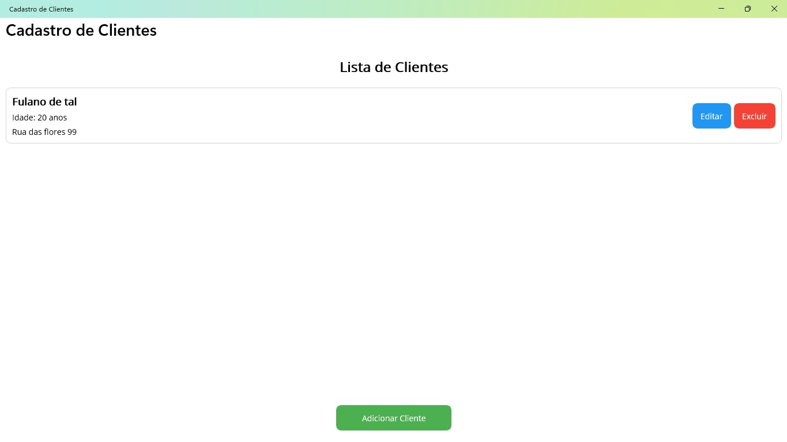
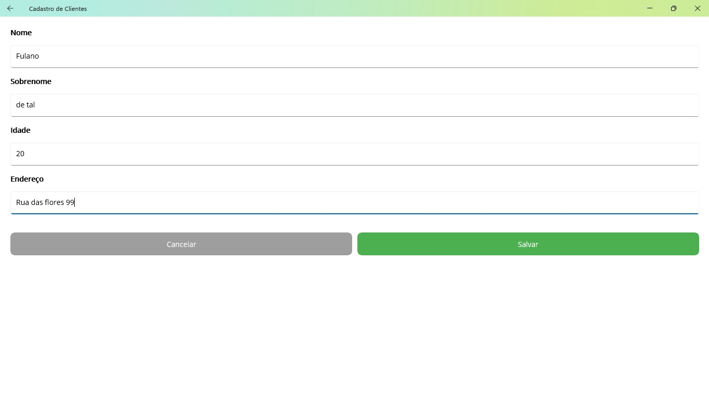
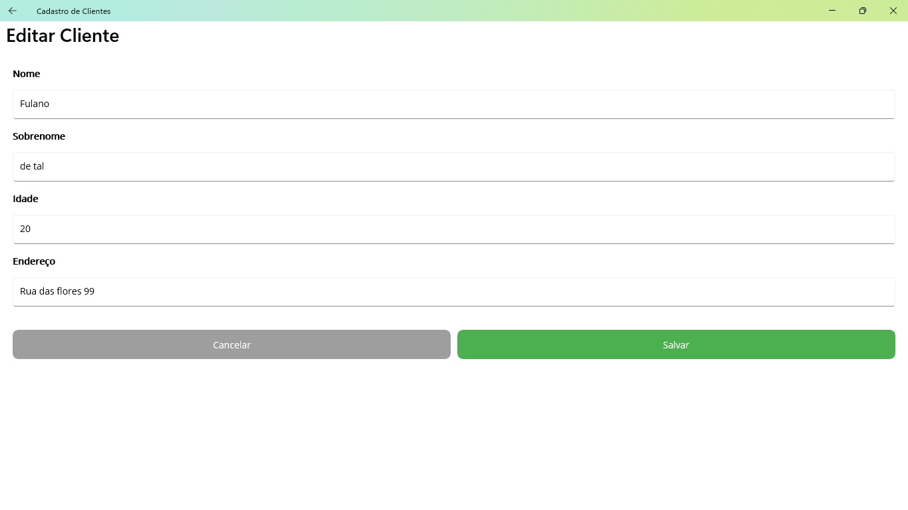
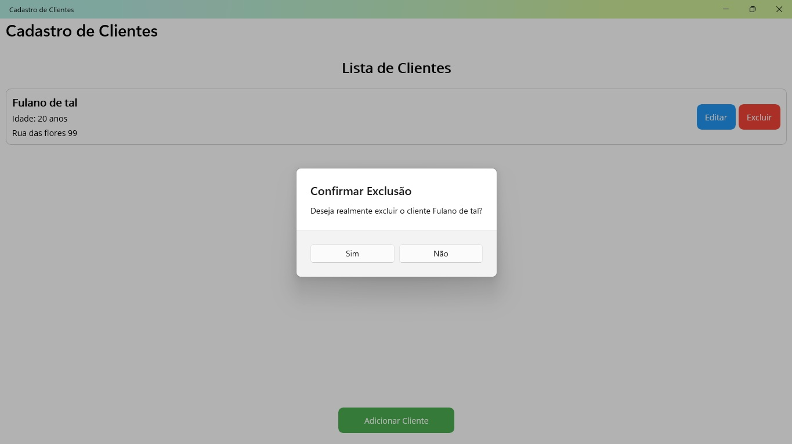

# ClientRegistration

Aplicativo de cadastro de clientes desenvolvido com .NET MAUI, multiplataforma (Android, iOS, Windows, MacCatalyst). Permite gerenciar uma lista de clientes, incluindo cadastro, edição, exclusão e visualização de detalhes.

## Funcionalidades
- Listagem de clientes cadastrados
- Cadastro de novos clientes
- Edição de dados de clientes existentes
- Exclusão de clientes

### Funcionalidades

- **Cadastro de Clientes:** Formulário para adicionar novos clientes com nome, e-mail e telefone.
- **Listagem de Clientes:** Visualização de todos os clientes cadastrados.
- **Edição de Clientes:** Modificação dos dados de clientes existentes.
- **Exclusão de Clientes:** Remoção de clientes do sistema.

## Tecnologias Utilizadas

- **.NET MAUI:** Framework para criação de aplicações multiplataforma (Windows, macOS, Android, iOS).
- **SQLite:** Banco de dados local para armazenamento de dados.
- **Padrão MVVM:** Arquitetura utilizada para separar a lógica de negócio da interface do usuário.

## Pré-requisitos

Antes de começar, garanta que você tenha o seguinte ambiente de desenvolvimento configurado:

- **.NET 9 SDK**
- **Visual Studio 2022** com a carga de trabalho **.NET Multi-platform App UI development** instalada.
- **Visual Studio Code** (Opcional) com as extensões **C# Dev Kit** e **.NET MAUI**.

## Como Executar a Aplicação

### Usando o Visual Studio 2022

1.  Clone o repositório para sua máquina local:
    ```bash
    git clone https://github.com/gimidia/ClientRegistration.git
    ```
2.  Navegue até o diretório do projeto.
3.  Abra o arquivo da solução `ClientRegistration.sln` com o Visual Studio 2022.
4.  Aguarde o Visual Studio restaurar todas as dependências do projeto (NuGet packages).
5.  Selecione o dispositivo de destino na barra de ferramentas (ex: `Windows Machine` para rodar no Windows ou um emulador Android).
6.  Pressione **F5** ou clique no botão **▶ Iniciar** para compilar e executar a aplicação.

### Usando o Visual Studio Code

1.  Clone o repositório para sua máquina local.
2.  Abra a pasta raiz do projeto (`ClientRegistration`) no Visual Studio Code.
3.  Abra um novo terminal no VS Code (**Terminal > New Terminal**).
4.  Restaure as dependências do projeto executando o comando:
    ```bash
    dotnet restore
    ```
5.  Compile o projeto:
    ```bash
    dotnet build
    ```
6.  Execute a aplicação para a plataforma desejada. Por exemplo, para Windows:
    ```bash
    dotnet build -t:Run -f net9.0-windows10.0.19041.0
    ```
    *Você pode encontrar os frameworks de destino disponíveis no arquivo `ClientRegistration.csproj`.*

## Estrutura do Projeto

- `Models/`: Contém as classes de modelo (ex: `Cliente`).
- `ViewModels/`: Contém os ViewModels que gerenciam a lógica da interface.
- `Views/`: Contém as páginas XAML da aplicação.
- `Services/`: Contém os serviços, como o de acesso ao banco de dados (`ClienteService`).
- `App.xaml.cs`: Ponto de entrada da aplicação.
- `MauiProgram.cs`: Configuração inicial da aplicação e injeção de dependência.

## Imagens da Aplicação

**Tela de Listagem:**


**Tela de Cadastro:**


**Tela de Edição:**


**Confirmação de Exclusão:**



Este projeto é apenas para fins de estudo/demonstração. 